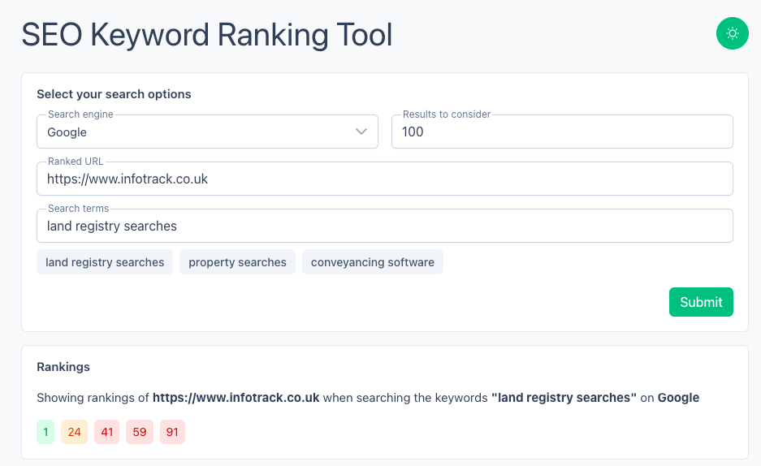
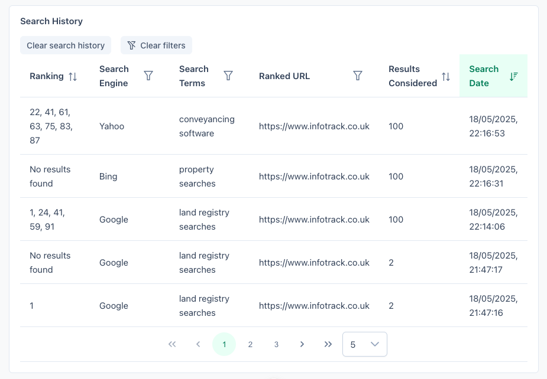
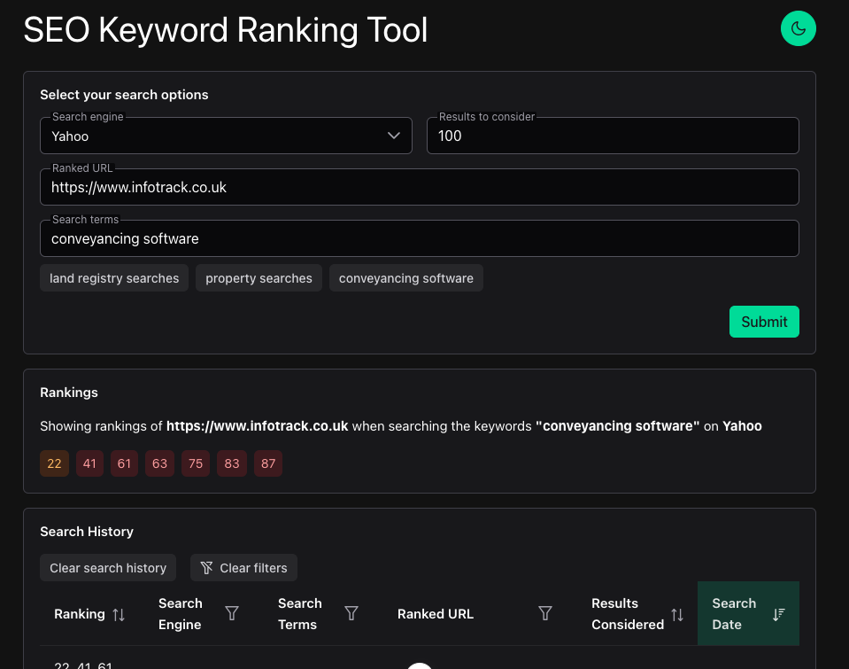

# SEO Keyword Ranking Tool

This is the UI for a tool that ranks a given URL for keyword searches across several search engines.

It is deployed at: https://nicolas-dolan.github.io/seo-ranking-tool/

## Features

- Specify search terms, search engine, the URL to be ranked, and how many results to consider
- Mocks the api: auto-generates a random set of rankings within the requested results range
- Saves a history of search results to local storage, which can be retrieved after the session ends
- Sortable and filterable table displaying previous search results with pagination
- Dark mode
- Responsive design

## Technologies Used

- Vue 3 composition api
- TypeScript
- Pinia
- PrimeVue
- VueUse
- zod
- scss/sass

## Local Project Setup

```sh
npm install
```

```sh
npm run dev
```

Go to: http://localhost:5173

## Screenshots






